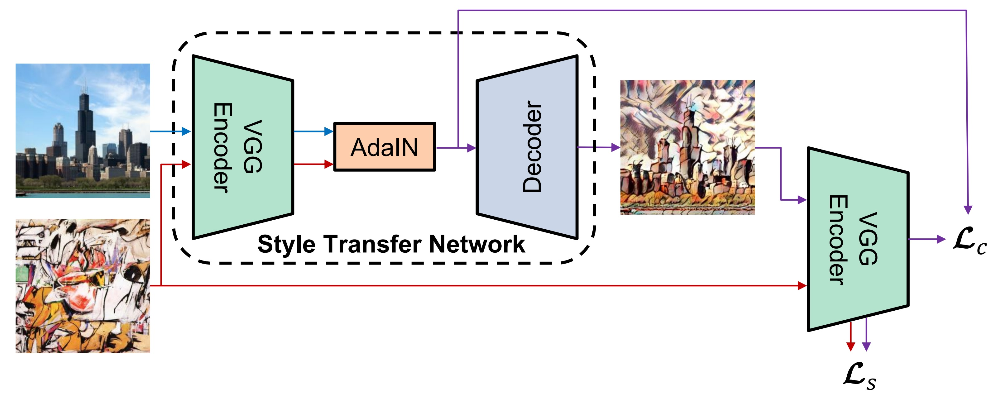

# PyTorch-AdaIN-StyleTransfer
This project is an unofficial PyTorch implementation of the paper using Google Colab: [**Arbitrary Style Transfer in Real-time with Adaptive Instance Normalization**](https://arxiv.org/abs/1703.06868)

All credit goes to: [Xun Huang](http://www.cs.cornell.edu/~xhuang/) and
[Serge Belongie](http://blogs.cornell.edu/techfaculty/serge-belongie/)

## Description
The paper implements a style transfer algorithm, which uses a fixed pretrained vgg19 (up to ReLU 4.1) to encode a style image and a content image. Then the style of the style image is transferred to the content image. The novel approach this paper describes uses an AdaIN layer. This layer first normalises the the content image to unit mean and standard deviation. After that the content image is scaled such that it's mean and standard deviation are equal to the mean and standard deviation of the style image. Then the image is decoded using a decoder that mirrors the vgg19.

  

## Requirements
- A google drive account to run the notebooks.
- A pretrained vgg19 pth file. I used the file provided by [Naoto Inoue](https://github.com/naoto0804/pytorch-AdaIN) in his implementation of the same paper. Link: [vgg_normalised.pth](https://drive.google.com/file/d/108uza-dsmwvbW2zv-G73jtVcMU_2Nb7Y/view).

To train:
- [2015 Coco Image Dataset, 13GB](http://images.cocodataset.org/zips/test2015.zip)
- [WikiArt Dataset, 25.4GB](http://web.fsktm.um.edu.my/~cschan/source/ICIP2017/wikiart.zip)

A note on the Datasets: The free version of Google Colab only has 30GB of usable storage while using the GPU. Thus you may have to reduce the size of the dataset. In this implementation I used 40k images of each dataset.

## Trained Model
You can download my model from [here](). It has been trained for 120.000 iteration and provides an image quality close to the offical implementation. The style weight (gamma) used was 2.0.

## Manual
- Copy the content of this repository into a Google Drive folder. Then download the pretrained vgg19 file and place it in the same folder. If you want to play around with the network add the pretrained network file as well. If you want to train the network from scratch, e.g change the style weight, download the datasets as well.
#### Interference
- Open the Style Transfer Test notebook. In the first cell you need to specify the directory of the folder in your Google Drive. Additionally if you changed the image folder you also need to change the `img_dir` variable accordingly.
- The next cell will load the network.
- Then the images are loaded. Here you can choose your images. 
- In the next cell you can change the `alpha` variable. This variable influences the impact of the style image on the content image.
#### Training
- Open the Style Transfer Train notebook. In the first cell you need to specify the directory of the folder in your Google Drive.
- Then you will have to download/import the datasets into the colab instance. I have not implemented this step as depending on your storage you will need to reduce the amount of images of each dataset used.
- Change the `pathStyleImages` and `pathContentImages` to the folders containing the images. Note the folder needs to only contain images. Nested folders are not supported
- Then run the rest of the cells.

## Results
